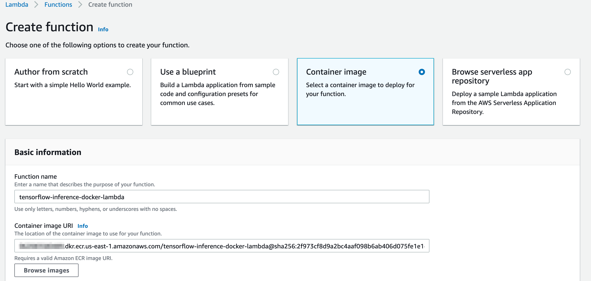

# Pay as you go TensorFlow inference with AWS Lambda (Docker image)

This repo contains resources to help you deploy a Lambda function based on Python Docker Image. 
The application illustrates how to perform inference with breast cancer XGBoost ML model.

## Building the Lambda Function Docker image, testing locally, and pushing to Amazon ECR registry
In the next steps you'll build the Docker image, and optionally test it on your machine. 
Next, you'll tag the Docker image and push it to [Amazon ECR Repository](https://docs.aws.amazon.com/AmazonECR/latest/userguide/Repositories.html).

### Create an image from an AWS base image for Lambda
Build your Docker image with the `docker build` command. Enter a name for the image. The following example names the image tensorflow-inference-docker-lambda.

`docker build -t tensorflow-inference-docker-lambda .`  

### (Optional) Test your application locally using the [runtime interface emulator](https://docs.aws.amazon.com/lambda/latest/dg/images-test.html)

Run your container image locally using the docker run command

`docker run -p 9000:8080 tensorflow-inference-docker-lambda:latest`

From a new terminal window, post an event to the following endpoint using a curl command:

```bash
curl -XPOST "http://localhost:9000/2015-03-31/functions/function/invocations" -d '{"url":"https://images.pexels.com/photos/310983/pexels-photo-310983.jpeg?auto=compress&cs=tinysrgb&dpr=2&h=650&w=940"}' .
```

This command invokes the function running in the container image and returns a response.

You should get a response as follows: 

`{
  "statusCode": 200,
  "body": "{\"detection_boxes\": [[0.4908023476600647, 0.29575255513191223, 0.9392691254615784, 0.7548272609710693], ... ,  [0.777909517288208, 0.17248520255088806, 0.8303424119949341, 0.2794511020183563], [0.7956447005271912, 0.7707855701446533, 0.8414708971977234, 0.8657528162002563], [0.4194037616252899, 0.38772422075271606, 0.5819851160049438, 0.6199124455451965], [0.4991573393344879, 0.660798966884613, 0.5842983722686768, 0.7324734330177307], [0.6248317956924438, 0.4229450225830078, 0.714311957359314, 0.4761013984680176], [0.5048995614051819, 0.06866246461868286,  ... , 0.06728839874267578, 0.06699958443641663, 0.06661209464073181, 0.0656241774559021], \"detection_class_entities\": [\"Bicycle\", \"Person\", \"Footwear\", \"Wheel\", ... , \"Human arm\", \"Footwear\", \"Footwear\", \"Person\", \"Human hair\", \"Human arm\"]}"
}`

### Create an Amazon ECR Repository

`aws ecr create-repository --repository-name tensorflow-inference-docker-lambda`

### Authenticate the Docker CLI to your Amazon ECR registry

Replace `<YOUR AWS ACCOUNT ID>` with your AWS account id

`aws ecr get-login-password --region us-east-1 | docker login --username AWS --password-stdin <YOUR AWS ACCOUNT ID>.dkr.ecr.us-east-1.amazonaws.com`

### Tag your image to match your repository name, and deploy the image to Amazon ECR using the docker push command

Replace `<YOUR AWS ACCOUNT ID>` with your AWS account id

`docker tag  tensorflow-inference-docker-lambda:latest <YOUR AWS ACCOUNT ID>.dkr.ecr.us-east-1.amazonaws.com/tensorflow-inference-docker-lambda:latest`

`docker push <YOUR AWS ACCOUNT ID>.dkr.ecr.us-east-1.amazonaws.com/tensorflow-inference-docker-lambda:latest`

## Creating the Lambda Function in AWS Console

In the next steps, you'll create the Lambda function in AWS console, using the container image built previously. 

### Create Function

1. Browse to the [Lambda console](https://console.aws.amazon.com/lambda).
2. Choose **_Create function_**.
3. On the next page, choose **_Container image_**. 
4. For Function name, use _tensorflow-inference-docker-lambda_.
5. For Container image URI, choose the **_Browse images_**, and choose the container image you pushed to ECR previously.
6. Choose **_Create function_**.



Wait for the function to be created.

### Modify Lambda memory and time out
Since the Lambda will load an XGBoost model and use it for inference you'll need to increase the time out and allocate more memory.

1. On the Basic settings section, choose _**Edit**_.
2. For Memory (MB), choose 4096 MB.
3. For Timeout, choose 2 minutes.
4. Choose _**Save**_.


## Testing your Lambda function

1. In the Lambda console, select Configure test events from the Test events dropdown.
2. For Event Name, enter InferenceTestEvent.
3. Copy the event JSON from [here](./test-event/test-event-1.json) and paste in the dialog box.
4. Choose _**Create**_.


After saving, you see InferenceTestEvent in the Test list. Now choose _**Test**_.

You see the Lambda function inference result, log output, and duration:


